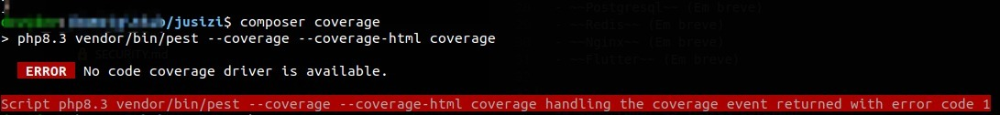

# B A M E S

## Descrição

O bames é um projeto focado atualmente em estudos de arquitetura, design e testes.
####  Como o negócio é voltado 100% ao Brasil, o projeto é desenvolvido em português.

## Arquitetura

A arquitetura do projeto é baseada em sistemas distribuídos, com comunicação assíncrona e orientada a eventos. A comunicação entre os serviços é feita através de mensageria, utilizando o RabbitMQ como broker.
O projeto é composto por 3 camadas principais: `Aplicacao`, `Dominio` e `Infraestrutura`.

## Design

O design do projeto é baseado em DDD (Domain Driven Design), com a separação de responsabilidades entre as camadas de aplicação, domínio e infraestrutura.

## Testes

O projeto está sendo desenvolvido utilizando o Pest como framework de testes.
A Cobertura de testes pode ser visualizada [aqui - Coverage](https://19950512.github.io/bames).


## Tecnologias

- PHP 8.3
- Docker Compose
- Postgresql
- Redis
- Nginx
- Firebase JWT
- RabbitMQ
- Flutter


## Como rodar os testes Coverage

Executou
```bash
composer coverage
```

Saída



Seu PHP8.3 não têm o xdebug instalado
```bash
apt install php8.3-xdebug
```

Agora, precisa adicionar esse conteúdo no arquivo `php.ini` se for linux, deve estar em `/etc/php/8.3/cli/php.ini`
```conf
[xdebug]
zend_extension=xdebug.so
xdebug.mode=coverage
xdebug.start_with_request=yes
```

Coloque o `xdebug.mode` como `coverage` para que o composer covarege funcione

## Documentação das APIs

#### Para atualizar a documentação
```bash
npx @redocly/cli build-docs src/Infraestrutura/APIs/Autenticacao/doc.yaml -o doc-api-auth.html --title API - Auth
```

Links das documentações

[API Auth](doc-api-auth.html)

### Dependencias

##### Doc2pdf
```bash
# unoconv para converter arquivos docx para pdf e libreoffice para unoconv funcionar
sudo apt install libreoffice
sudo apt install unoconv
```

```bash
sudo /usr/bin/doc2pdf --headless -o /tmp/doc2pdf.pdf /path/to/documento.docx
```

